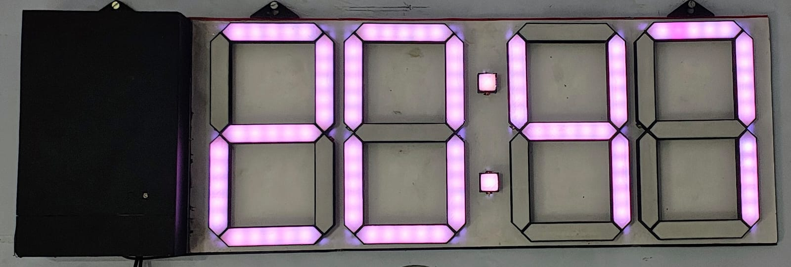

# NeoPixel-7-segment-Wall-Clock
A custom 4-digit NeoPixel 7-segment wall clock powered by an ESP8266, featuring DS3231 RTC timekeeping, automatic brightness control, and a custom-built LED display with OTA updates and Internet time sync.

# 🕐 NeoPixel Smart Wall Clock

A custom-built, Wi-Fi connected 4-digit digital wall clock using individually addressable **WS2812B NeoPixel LEDs**, an **ESP8266 NodeMCU**, and a **DS3231 RTC**. The display is built from scratch using a custom 7-segment LED mapping, with 5 LEDs per segment for a bold, vibrant look.

> Connect your phone to the clock's own Wi-Fi hotspot and configure everything — colors, brightness, Wi-Fi credentials, and timezone — from a sleek web interface. No app needed.



---

## ✨ Features

### Display
- 4-digit 7-segment clock face built from **142 individually addressable NeoPixel LEDs**
- 5 LEDs per segment, 1 LED per colon dot
- Blinking colon every second
- **Time-of-day color theming** — the display color changes automatically throughout the day:

| Period | Hours | Default Color |
|---|---|---|
| 🌅 Morning | 05:00 – 10:00 | Warm yellowish-white |
| ☀️ Noon | 10:00 – 16:00 | Soft blue |
| 🌆 Evening | 16:00 – 19:00 | Warm orange |
| 🌙 Night | 19:00 – 05:00 | Lavender |

### Automatic Brightness
- LDR continuously monitors ambient light
- Brightness **smoothly fades** between a configurable minimum and maximum — no sudden jumps
- Comfortable in both a dark bedroom and a bright office

### Web Configuration UI
Hosted directly on the ESP8266 at `http://192.168.4.1` or `http://wallclock.local` — no internet connection or app required.

- 🎨 **Color pickers** for all four time-of-day themes
- 💡 **Min/Max brightness sliders**
- 📡 **Wi-Fi credentials** input (SSID + password)
- 🌍 **Timezone selector** — 34 common UTC offsets, IST pre-selected
- ⚡ **OTA firmware update** — drag and drop a `.bin` file, no USB cable needed after initial flash
- 🕐 **Live clock** on the page with an NTP sync badge
- All settings **saved to EEPROM** and survive power cycles

### NTP Time Sync
- Clock connects to your home Wi-Fi in the background while the config hotspot stays up
- Syncs time from `pool.ntp.org` automatically on connect
- Updates the DS3231 RTC from NTP — RTC keeps time accurately even if Wi-Fi drops
- **Re-syncs every 6 hours** automatically
- Manual **Sync Now** button in the web UI
- Auto-reconnects and retries every 60 seconds if Wi-Fi drops

---

## 🔧 Hardware

| Component | Quantity | Purpose |
|---|---|---|
| ESP8266 NodeMCU v1.0 | 1 | Main controller |
| WS2812B NeoPixel LEDs | 142 | 7-segment display |
| DS3231 RTC module | 1 | Accurate timekeeping |
| LDR (photoresistor) | 1 | Ambient light sensing |
| 10kΩ resistor | 1 | LDR voltage divider |
| 470Ω resistor | 1 | NeoPixel data line |
| 1000µF capacitor | 1 | Power supply decoupling |
| 5V power supply | 1 | LED + controller power (3A+ recommended) |

### Wiring

```
ESP8266 Pin   →   Component
─────────────────────────────
D5            →   NeoPixel DATA IN (via 470Ω)
A0            →   LDR (voltage divider with 10kΩ to GND)
D1 (SCL)      →   DS3231 SCL
D2 (SDA)      →   DS3231 SDA
3.3V          →   DS3231 VCC
GND           →   DS3231 GND, LDR divider GND
5V (external) →   NeoPixel +5V
GND (shared)  →   NeoPixel GND
```

> ⚠️ Do not power 142 NeoPixels from the ESP8266's 3.3V pin. Use a dedicated 5V supply and share the GND.

---

## 🏗️ System Architecture

```
                    ┌─────────────────────────────┐
                    │         ESP8266              │
                    │                             │
  DS3231 ──I2C──►  │  RTC reader                 │
                    │  ├─ NTP sync (SNTP)         │──► NeoPixel Strip (D5)
  LDR ────ADC────►  │  ├─ Brightness control      │    142 × WS2812B
                    │  ├─ Segment mapper           │
  Home Router ───►  │  └─ Web server :80          │
  (optional)        │                             │
                    │  AP: WallClock (always on)  │◄── Browser / Phone
                    └─────────────────────────────┘
```

**Dual Wi-Fi mode (`WIFI_AP_STA`):** The clock always broadcasts its own `WallClock` hotspot for configuration while simultaneously connecting to your home router for NTP.

---

## 💾 Firmware

### Libraries Required

Install via Arduino Library Manager:

| Library | Version |
|---|---|
| Adafruit NeoPixel | Latest |
| RTClib (Adafruit) | Latest |

Built into the ESP8266 Arduino core (no install needed):
`ESP8266WiFi` · `ESP8266WebServer` · `ESP8266mDNS` · `DNSServer` · `EEPROM` · `time.h`

### Arduino IDE Board Settings

| Setting | Value |
|---|---|
| Board | NodeMCU 1.0 (ESP-12E Module) |
| Flash Size | 4MB (FS: 2MB, OTA: ~1019KB) |
| CPU Frequency | 80 MHz |
| Upload Speed | 115200 |

### Segment Layout

The 31 logical segments map to 142 physical LEDs:

```
 Digit 0    Digit 1   Colon   Digit 2    Digit 3
┌──────┐   ┌──────┐   ●●    ┌──────┐   ┌──────┐
│  7×5 │   │  7×5 │         │  7×5 │   │  7×5 │
│  LEDs│   │  LEDs│         │  LEDs│   │  LEDs│
└──────┘   └──────┘         └──────┘   └──────┘
  (35)       (35)    (2)      (35)       (35)
```

Each digit uses the standard 7-segment pattern (`a`–`g`), with 5 NeoPixels per segment chained in a single addressable strip.

### Key Design Decisions

- **Modular architecture** — display rendering, segment mapping, RTC comms, brightness control, web server, and NTP are all independent functions
- **Non-blocking loop** — Wi-Fi connection, NTP sync, and brightness ramp all use state machines so nothing stalls the display
- **EEPROM magic byte** — settings struct versioning detects firmware upgrades and re-applies factory defaults automatically

---

## 🌐 Web Interface

1. On your phone or laptop, connect to Wi-Fi: **`WallClock`** (password: `clockwifi`)
2. Open `http://192.168.4.1` — the config page loads immediately (captive portal redirects automatically on most phones)

### Sections

**Colors & Brightness** — Pick colors for each time period; set LDR brightness floor and ceiling. Hit **Save**.

**Wi-Fi & NTP** — Enter your home Wi-Fi SSID, password, and timezone. Hit **Connect & Sync**. The clock connects in the background; the status badge updates live every 3 seconds. Use **Sync Time Now** to force an immediate NTP update.

**OTA Firmware Update** — In Arduino IDE, go to `Sketch → Export Compiled Binary`. Upload the `.bin` file from this page. A progress bar tracks the upload; the clock reboots automatically when done.

---

## ⚙️ Configuration Reference

| EEPROM Setting | Default | Range |
|---|---|---|
| Morning color | `#FFF0B4` (warm white) | Any RGB |
| Noon color | `#0064FF` (blue) | Any RGB |
| Evening color | `#FF7828` (orange) | Any RGB |
| Night color | `#B48CFF` (lavender) | Any RGB |
| Min brightness | 10 | 1 – 100 |
| Max brightness | 150 | 50 – 255 |
| Timezone offset | +330 min (IST) | −720 to +840 |
| Wi-Fi SSID | *(empty)* | Up to 32 chars |
| Wi-Fi Password | *(empty)* | Up to 64 chars |

> Settings survive power cycles. Flashing new firmware resets to defaults only if the EEPROM magic byte changes (i.e. the settings struct was extended).

---

## 🖨️ Mechanical Design

*(Add photos, STL files, and print settings here)*

The enclosure mounts the LED strip in a 3D-printed frame designed in **Fusion 360**, with channels to diffuse each segment individually.

---

## 🔨 Assembly

1. Print or fabricate the enclosure and segment dividers
2. Cut and wire the NeoPixel strip per the segment map (see `docs/segment_wiring.pdf`)
3. Mount the DS3231 and ESP8266 on a perfboard or custom PCB
4. Wire the LDR voltage divider to `A0`
5. Flash the firmware via USB (`WallClock_WebConfig_NTP.ino`)
6. Power up, join the `WallClock` hotspot, and configure via the web UI
7. Future updates can be pushed wirelessly via the OTA page

---

## 📸 Results

*(Add demo photos and video link here)*

---

## 🔮 Future Improvements

- [ ] Alarm and countdown timer via web UI
- [ ] Temperature/humidity display mode (DHT22)
- [ ] Multiple display animation themes (WLED-style effects)
- [ ] Date display mode (toggle with a button or gesture)
- [ ] WLED integration for advanced color palettes
- [ ] Custom PCB to replace perfboard wiring
- [ ] Brightness curve calibration per-room profile

---

## 📄 License

MIT License — see [LICENSE](LICENSE) for details.

---

*Built by [Vedant Dehankar](mailto:vedantdehankar629@gmail.com) · RCOEM, Nagpur*
